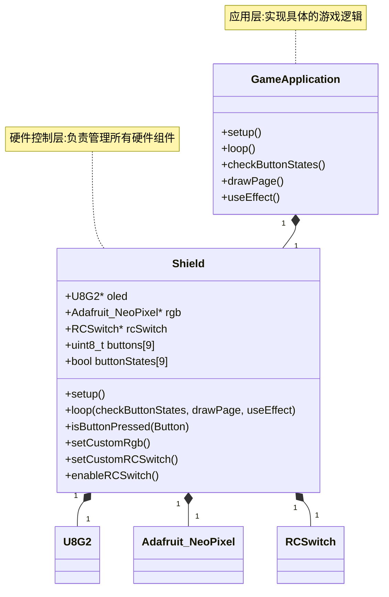

# AbenoGameBoyShield

[Abeno GameBoy Shield](https://oshwhub.com/rushairer/arduinogameboyshield) 驱动库。

## 架构



## 示例

examples/Game.ino 是一个基于本库开发的石头剪刀布游戏。

## 启动模板

```c++
#include <Arduino.h>
#include <AbenoGameBoyShield.h>

using namespace AbenoGameBoyShield;

Shield shield;

void checkButtonStates();
void drawPage();
void useEffect();

void setup()
{
    Serial.begin(115200);

    shield.setup();
    shield.oled->setFontPosTop();
    shield.oled->setFont(u8g2_font_timR08_tf);
    shield.oled->setFontMode(1);
    shield.oled->setBitmapMode(1);
    shield.oled->setFontPosTop();
    shield.oled->enableUTF8Print();
}

void loop()
{
    shield.loop(checkButtonStates, drawPage, useEffect);
}

void checkButtonStates()
{
    // 检查按钮状态，根据用户输入做出改变
    // 例如:
    //     if (shield.isButtonPressed(Button1))
    //     {
    //         playerAction = ACTION_ROCK;
    //         gameState = GAME_STATE_COMPARE;
    //     }

}

void drawPage()
{
    // 根据游戏状态，画出每一帧的画面
    // !! 千万不要使用delay的方式延长画面持续时间
}

void useEffect()
{
    // 游戏状态改变后，产生的副作用
}
```
